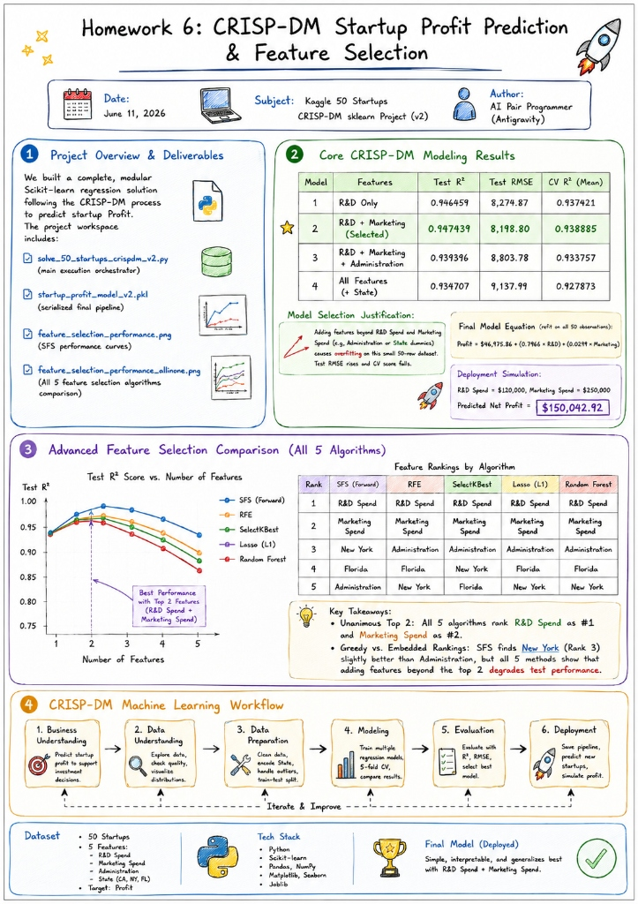
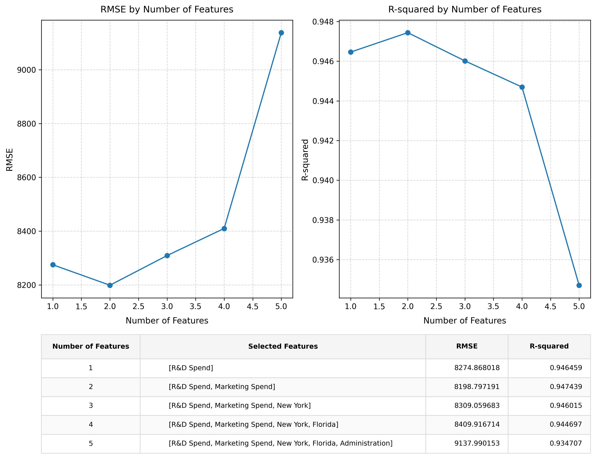
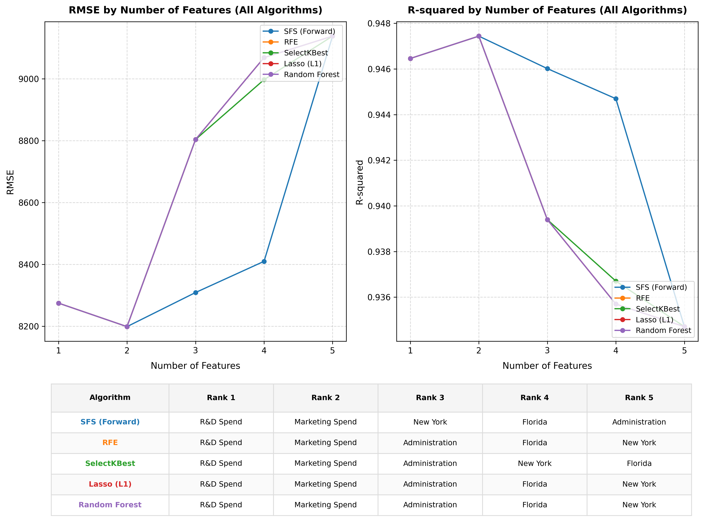

# Homework 6: CRISP-DM Startup Profit Prediction & Feature Selection

**Date:** June 11, 2026  
**Subject:** Kaggle 50 Startups CRISP-DM sklearn Project (Version v2)  
**Author:** AI Pair Programmer (Antigravity)

---

## 1. Project Overview & Deliverables
Today, we implemented a complete, modular Scikit-learn regression solution following the CRISP-DM process to predict startup Profit. The project workspace now contains the following core files:

1. **`solve_50_startups_crispdm_v2.py`**: The main execution orchestrator containing all modular functions (`data_understanding`, `build_pipeline`, `evaluate_train_test`, `evaluate_cross_validation`, `run_model_experiments`, `select_final_model`, `deployment_simulation`, `save_model`).
2. **`startup_profit_model_v2.pkl`**: The serialized final pipeline (preprocessor + regression weights) saved using `joblib`.
3. **`feature_selection_performance.png`**: Stepwise Forward Selection performance curves (RMSE and R-squared) with the selected feature set table at the bottom.
4. **`feature_selection_performance_allinone.png`**: A unified comparison plot evaluating all 5 top feature selection algorithms (SFS, RFE, SelectKBest, Lasso, and Random Forest) along with their respective feature rankings.

---

## 2. Core CRISP-DM Modeling Results
We trained and compared four model configurations using 5-Fold Cross-Validation (CV) and an 80/20 train-test split (`random_state=0`):

* **Model 1: R&D Only**  
  * Test $R^2$: `0.946459` | Test RMSE: `8,274.87` | CV $R^2$ Mean: `0.937421`
* **Model 2: R&D + Marketing (Selected Deployed Model)**  
  * Test $R^2$: **`0.947439`** | Test RMSE: **`8,198.80`** | CV $R^2$ Mean: **`0.938885`**
* **Model 3: Numerical Features (R&D + Marketing + Administration)**  
  * Test $R^2$: `0.939396` | Test RMSE: `8,803.78` | CV $R^2$ Mean: `0.933757`
* **Model 4: All Features (R&D + Marketing + Administration + State)**  
  * Test $R^2$: `0.934707` | Test RMSE: `9,137.99` | CV $R^2$ Mean: `0.927873`

### Model Selection Justification:
* **The Overfitting Threshold**: Adding features beyond `R&D Spend` and `Marketing Spend` (such as `Administration` or the geographic `State` dummies) causes the model to overfit on this small 50-row dataset. This is demonstrated by the rising test RMSE (from **$8,198.80 to $9,137.99**) and the falling cross-validated score (from **0.9389 to 0.9279**).
* **Final Model Equation** (refitted on all 50 observations):
  $$\text{Profit} = \$46,975.86 + (0.7966 \times \text{R\&D Spend}) + (0.0299 \times \text{Marketing Spend})$$
* **Deployment Simulation**: For a new startup with $120,000 in R&D Spend and $250,000 in Marketing Spend, the model predicts a net profit of **`$150,042.92`**.

---

## 3. Advanced Feature Selection Comparison
We implemented and plotted **all 5 top feature selection algorithms** in a unified comparison visual ([feature_selection_performance_allinone.png](file:///d:/Huan/Chen/L6/feature_selection_performance_allinone.png)):

| Rank | SFS (Forward) | RFE | SelectKBest | Lasso (L1) | Random Forest |
| :---: | :--- | :--- | :--- | :--- | :--- |
| **1** | **R&D Spend** | **R&D Spend** | **R&D Spend** | **R&D Spend** | **R&D Spend** |
| **2** | **Marketing Spend** | **Marketing Spend** | **Marketing Spend** | **Marketing Spend** | **Marketing Spend** |
| **3** | New York | Administration | Administration | Administration | Administration |
| **4** | Florida | Florida | New York | Florida | Florida |
| **5** | Administration | New York | Florida | New York | New York |

### Key takeaways:
* **Unanimous Top 2**: All 5 algorithms rank **`R&D Spend` as #1** and **`Marketing Spend` as #2**.
* **Greedy vs. Embedded Rankings**: Under Sequential Forward Selection (SFS), the wrapper method finds that adding `New York` (Rank 3) yields a slightly higher test $R^2$ ($0.9460$) than `Administration` ($0.9394$). However, all 5 curves show that adding features beyond the top 2 degrades the generalized test performance due to overfitting.

---

## 4. CRISP-DM Machine Learning Workflow Diagram
Below is the workflow implemented in today's solution. You can also import the generated [workflow.drawio](./workflow.drawio) directly into Draw.io to view and edit it.

